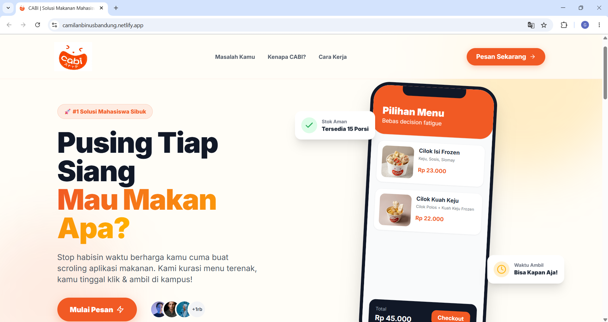
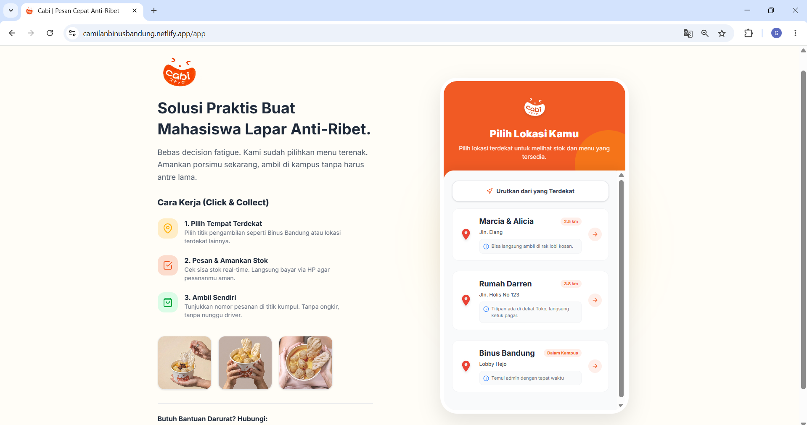
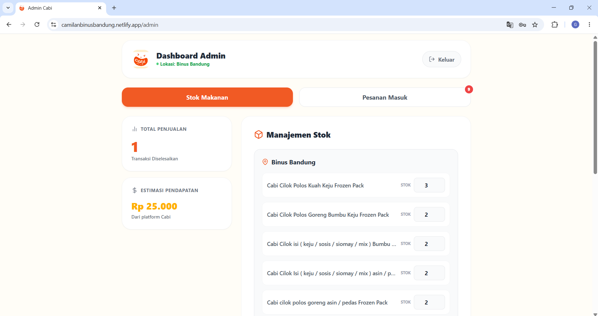

# 🍡 CABI — Click & Collect Cimol/Cilok Platform

> **Solusi Makan Cepat, Anti-Ribet buat Mahasiswa.**

CABI adalah platform pre-order makanan Click & Collect yang dirancang khusus untuk mahasiswa. Menghilangkan *decision fatigue*, ongkir mahal, dan waktu tunggu lama dengan menyediakan menu terkurasi yang bisa dipesan dan diambil di titik pickup strategis sekitar kampus.

---

## 📸 Screenshots

### Landing Page

## Preview


- Hero section dengan phone mockup interaktif
- Problem statement yang relatable untuk mahasiswa
- Step-by-step cara kerja yang simpel

### App — Menu & Ordering

## Preview


- Pilih lokasi pickup terdekat (dengan GPS sorting)
- Browse menu dengan stok real-time
- Checkout dengan opsi Ambil Sendiri / Delivery
- Konfirmasi pesanan via WhatsApp

### Admin Dashboard

## Preview


- Login dengan Supabase Auth
- Manajemen stok per lokasi (real-time sync)
- CRUD menu (nama, harga, foto, deskripsi)
- Terima/tolak pesanan masuk

---

## ✨ Fitur Utama

| Fitur | Deskripsi |
|---|---|
| 📍 Pilih Lokasi | 4 titik pickup strategis sekitar kampus, sortable by GPS |
| 🛒 Pre-Order Menu | Browse, tambah ke cart, checkout dalam hitungan detik |
| 🚚 Pickup / Delivery | Toggle metode pengambilan + input alamat untuk delivery |
| 💬 WhatsApp Integration | Template chat otomatis ke admin dengan detail pesanan |
| 📊 Admin Dashboard | Kelola stok, menu, dan pesanan masuk secara real-time |
| 🔄 Auto-Sync Stok | Stok otomatis terupdate saat admin konfirmasi pesanan |
| 💳 Transfer BCA | Detail pembayaran langsung di modal sukses |
| 🔐 Supabase Auth | Admin login dengan email/password, dilindungi RLS |

---

## 🛠️ Tech Stack

| Layer | Teknologi |
|---|---|
| **Frontend** | HTML5, JavaScript (ES Modules), Tailwind CSS v4 |
| **Build Tool** | Vite 8 |
| **Backend (BaaS)** | Supabase (PostgreSQL, Auth, Storage, RLS) |
| **Icons** | Feather Icons |
| **Font** | Inter (Google Fonts) |
| **Deployment** | Netlify (static hosting) |

---

## 🚀 Live Demo

🔗 **Live URL**: https://camilanbinusbandung.netlify.app

### Akun Demo Admin:
- **Email**: *(masukkan email admin)*
- **Password**: *(masukkan password admin)*
(User tidak perlu Login)
---

## 📁 Struktur Proyek

```
CABI/
├── index.html          # Landing page
├── app.html            # Aplikasi ordering (customer)
├── admin.html          # Dashboard admin
├── script.js           # Logic aplikasi customer
├── admin.js            # Logic dashboard admin
├── supabase.js         # Supabase client config
├── style.css           # Custom styles
├── vite.config.js      # Vite multi-page config
├── .env                # Environment variables (not committed)
├── assets/             # Gambar, logo, foto produk
├── PRD.md              # Product Requirements Document
├── CLAUDE.md           # AI Coding Guidelines
├── TASKS.md            # Task checklist
├── SECURITY-AUDIT.md   # Security audit report
└── README.md           # File ini
```

---

## ⚙️ Setup Lokal

### Prerequisites
- Node.js 18+
- Akun Supabase (free tier)

### Instalasi

```bash
# Clone repo
git clone https://github.com/USERNAME/cabi.git
cd cabi

# Install dependencies
npm install

# Setup environment variables
cp .env.example .env
# Isi VITE_SUPABASE_URL dan VITE_SUPABASE_ANON_KEY

# Jalankan development server
npm run dev

# Build untuk production
npm run build
```

### Setup Database
Jalankan `supabase_setup.sql` di Supabase SQL Editor untuk membuat tabel-tabel yang diperlukan.

---

## 📄 Dokumentasi

- [PRD.md](./PRD.md) — Product Requirements Document
- [CLAUDE.md](./CLAUDE.md) — AI Coding Guidelines & Rules
- [TASKS.md](./TASKS.md) — Development Task Checklist
- [SECURITY-AUDIT.md](./SECURITY-AUDIT.md) — Security Audit Report

---

## 👥 Tim

**Cabi Indonesia** — Solusi makan mahasiswa anti-ribet.

---

© 2026 Cabi Indonesia. All rights reserved.
